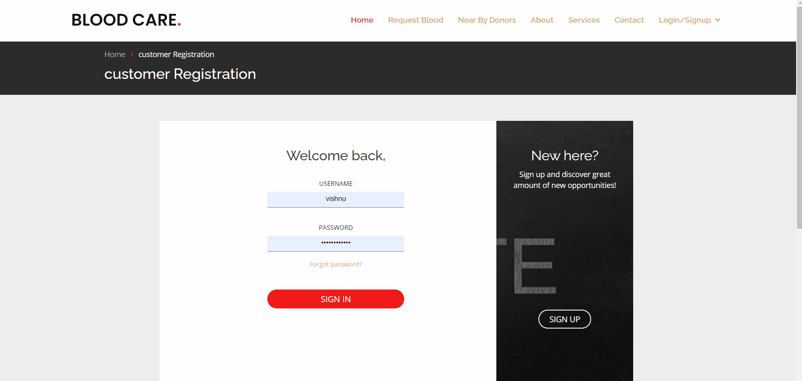

# Bloodcare
## Problem statement
Despite advances in technology, today's blood bank systems are running in manual system.  As such, there is a  prevalent problem  in the availability of needed blood types.

When a patient requires a rare blood group, if the hospital is running out of stock then family members and relatives are  trying  with social media for blood donors which is useless.

Health domain is pushing in all directions for providing awareness in advantages of the blood donation by conducting various camps, but still many don’t consider it as their responsibility, how can be these situations overcomed?
## Home page


## login page


## We have provided a Service where the user can order blood from a Blood Bank


## Exposing services
NEAR BY BLOOD DONORS API: DATABASE OF THE NEARBY DONORS IS PROVIDED TO THE REQUESTED BLOOD DONATION CAMPS.

NEAR BY BLOOD BANKS API:   DETAILS OF THE NEARBY BLOOD BANKS  ARE PROVIDED ON REQUEST

HOSPITALS  CAN CHECK THE AVAILABILITY OF THE REQUIRED BLOOD GROUP IN THE NEAR BY BLOOD BANKS.
## Consuming services
RAZORPAY PAYMENT  SERVICE

OTP SMS  SERVICE FOR  PHONE  NUMBER  AUTHENTICATION  (2 FACTOR SMS SERVICE PROVIDER)

SOCIAL MEDIA PROMOTION SERVICE

CHATBOT FOR USER EXPERIENCE

## prerequisites
* Django
* python
* mysql
* Django-rest-framework

## Steps to setup mysql
* Install xampp
* start mysql and apache in actions
* change the following in settings.py as follows:

```
DATABASES = {
    'default': {
        'ENGINE': 'django.db.backends.mysql',
        'NAME': 'Bloodcare',
        'USER':'root',
        'PASSWORD':'',
        'HOST': 'localhost',
        'PORT':'3306',
        'OPTIONS': {
            'init_command':"SET sql_mode = 'STRICT_TRANS_TABLES'"
        }
    }
}
```
## Steps to run the project
* clone the repo
* make migrations and migrate
```
python manage.py makemigrations

python manage.py migrate
```
* create superuser
```
python manage.py createsuperuser
```
* Run the server
```
python manage.py runserver
```
## Testing the APIs
Testing was done in insomnia for all services(get,put,post,delete)
## Unit testing
Unit testing was done for all views,urls,forms in the website.
reference used for testing:
```
https://youtube.com/playlist?list=PLbpAWbHbi5rMF2j5n6imm0enrSD9eQUaM
```

